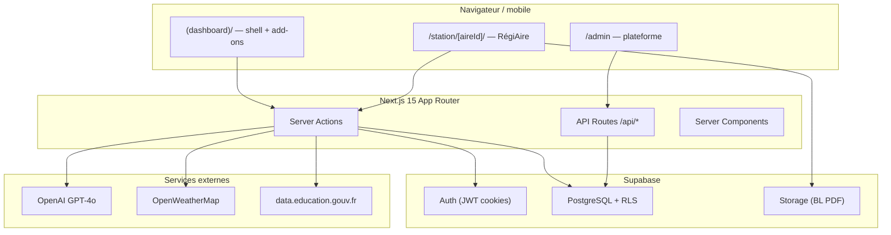
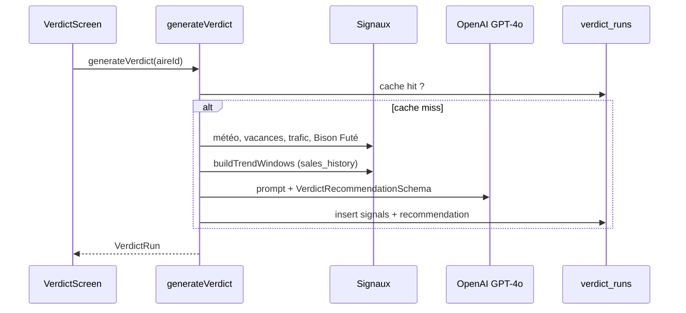

# OrbitAI — Architecture technique

> Document de référence pour développeurs et assistants IA. Dernière révision : juin 2026.

---

## 1. Vue d’ensemble



---

## 2. Multi-tenant et modules

### Modèle de données (conceptuel)

```
organizations
  ├── organization_members (user_id, role: owner|admin|member)
  ├── organization_modules (module_name, is_enabled)
  └── aires (RégiAire — une org peut en avoir plusieurs)

organization_modules.module_name :
  ├── Verticals métier : regiaire_core | artisan_core | hotel_core
  └── Add-ons piliers : copilot-transmission | detection-automation | …
```

### Activation

- Catalogue : `src/lib/organizations/module-catalog.ts`
- Types : `src/lib/organizations/types.ts` (`ORG_MODULE_NAMES`)
- Vérification runtime : RPC Supabase `org_has_module`, `get_my_enabled_modules`
- Branding dashboard : `src/lib/organizations/saas-branding.ts` (RégiAire / Artisan / NodAll)

### Rôles

| Rôle | Périmètre |
|------|-----------|
| `owner` / `admin` org | Réglages org, membres, délais fournisseurs |
| `member` | Opérations RégiAire sur les aires de l’org |
| Admin plateforme | `ORBIT_ADMIN_EMAILS` → `/admin`, service_role pour Bison Futé |

---

## 3. Authentification

| Mécanisme | Usage |
|-----------|--------|
| **Supabase Auth** | Principal — login `/login`, callback, cookies `@supabase/ssr` |
| **NextAuth + Prisma** | Legacy Discord — tables Prisma séparées |

Helpers serveur :

- `src/server/auth/supabase-server.ts` — client serveur, `getAuthenticatedUser()`
- `src/lib/supabase-write.ts` — `forWrite(client)` pour écritures typées

---

## 4. Routing App Router

```
src/app/
├── layout.tsx                    # Racine
├── login/
├── (dashboard)/
│   ├── layout.tsx                # DashboardShell + navigation
│   ├── page.tsx                  # Piliers add-on + GlobalDashboard RégiAire
│   └── station/
│       ├── page.tsx              # Liste aires / redirect
│       └── [aireId]/
│           ├── layout.tsx        # Header station, nav RégiAire
│           ├── dashboard/
│           ├── deliveries/       # + new, [id]/scan
│           ├── equipe/           # + config, historique
│           └── verdict/
└── admin/
    ├── page.tsx                  # Clients
    └── bison-fute/             # Calendrier Bison Futé plateforme
```

Navigation RégiAire : `src/lib/organizations/navigation.ts` → `buildStationNavLinks(aireId)`.

---

## 5. Pattern RégiAire (serveur)

Toute action métier RégiAire scoped **org + aire** :

```typescript
// src/lib/regiaire/require-context.ts
const ctx = await requireRegiaireContext(aireId);
// ctx : { userId, organizationId, aireId, supabase, db }
await ctx.db.from("deliveries").insert({ ... });
```

Chaîne d’accès :

1. Session Supabase valide
2. Org primaire de l’utilisateur (`getPrimaryOrganizationForUser`)
3. Module `regiaire_core` activé (`requireRegiaireAccess`)
4. `aireId` appartient à l’org

**Admin plateforme** (Bison Futé, provisioning) : `service_role` via `SUPABASE_SERVICE_ROLE_KEY`, jamais depuis le client user.

---

## 6. Base de données

### Source de vérité

| Fichier | Rôle |
|---------|------|
| `database/init.sql` | Schéma complet idempotent |
| `database/migrations/001–027` | Historique incrémental |
| `database/seeds/013–017` | Données démo |
| `src/types/database.types.ts` | Types TypeScript tables Supabase |

### Migrations RégiAire (ordre logique)

| # | Sujet |
|---|--------|
| 013 | Réception : suppliers, products, deliveries, stock_batches, RLS |
| 014–017 | Scan RPC, unicité BL, multi-aires |
| 018 | Équipe / shift |
| 020 | Verdict : sales_history, traffic_signals, verdict_runs |
| 021 | Cache verdict unique par org/aire/date |
| 022 | Multi-aires : `aire_id` sur opérations |
| 024–025 | Adresse aires, RLS client read-only |
| 026 | Bison Futé : zone aire + table forecast |
| 027 | Réappro : `lead_time_days`, `products.supplier_id` |

### Tables RégiAire clés

```
suppliers ──< products ──< stock_batches
                │
deliveries ──< delivery_lines
    │
    └──> stock_batches (delivery_id NOT NULL à la finalisation)

aires ──< sales_history, traffic_signals, deliveries, stock_batches
verdict_runs (cache JSON signals + recommendation par aire/date)
bison_fute_forecast (admin plateforme, par zone/date/direction)
shift_closures, shift_task_defs, shift_task_checks (équipe)
```

### Storage

- Bucket `regiaire-bl` — PDF bons de livraison, path org-scoped.

### RLS

Politiques `regiaire_*` : accès via `is_org_member(organization_id)`. Les écritures passent par le client user authentifié (pas service_role côté station).

---

## 7. Modules code (`src/features/`)

```
features/
├── regiaire/              # CŒUR MÉTIER
│   ├── aires/             # CRUD aires, autocomplete adresse
│   ├── reception/         # BL, scan, finalize, stock
│   ├── shift/             # Passation équipe
│   ├── verdict/           # Signaux, IA, réappro, périmés
│   ├── organization/      # (via features/organization)
│   └── lib/demo-aire.ts
├── organization/          # Profil org, membres, fournisseurs
├── admin/                 # Provisioning clients, Bison Futé admin
└── pillars/               # ADD-ONS (5 piliers)
    ├── copilot-transmission/
    ├── detection-automation/
    ├── decision-simulation/
    ├── client-synthesis/
    └── emotional-ai/
```

Chaque domaine RégiAire suit le pattern :

- `schemas.ts` — Zod
- `actions/*.ts` — Server Actions (`"use server"`)
- `components/` — UI client
- `*-access.ts` — lectures SQL réutilisables

---

## 8. Verdict IA — pipeline



Signaux (`src/features/regiaire/verdict/signals/`) :

| Signal | Source | Fallback |
|--------|--------|----------|
| Météo | OpenWeatherMap 2.5 | `available: false`, `forecast: null` |
| Vacances | API Éducation nationale | idem |
| Trafic | `traffic_signals` BDD | seed simulé |
| Bison Futé | `bison_fute_forecast` + zone aire | admin plateforme |
| Tendances | `sales_history` 15j vs N-1 aligné | seed simulé |

---

## 9. Réappro v2 (étape A)

Module : `src/features/regiaire/verdict/replenishment/`

| Fichier | Rôle |
|---------|------|
| `demand-multipliers.ts` | Règles v1 (chaleur, Bison, vacances) |
| `project-demand.ts` | Baseline par jour de semaine (12 sem.) |
| `compute-plan.ts` | Stock, manque, qty, orderByDate |
| `actions/generate-replenishment-plan.ts` | Point d’entrée |

**Limitation v1** : commandes déjà passées non déduites.

---

## 10. API Routes (add-ons & admin)

Principales routes hors Server Actions :

| Route | Pilier / usage |
|-------|----------------|
| `/api/chat` | Copilot RAG |
| `/api/extract` | Upload documents |
| `/api/decision-*` | Simulation |
| `/api/client-feedback/*` | Synthèse client |
| `/api/track-activity` | Automatisation |
| `/api/review/*` | AI Review Engine |
| `/api/admin/clients` | Provisioning |
| `/api/regiaire/address-search` | BAN adresses aires |

RégiAire métier : **Server Actions** prioritairement (pas REST public).

---

## 11. IA et schémas

- Vercel AI SDK : `generateObject`, `streamText`
- Modèle Verdict : `gpt-4o` (`generate-verdict.ts`)
- Schémas Zod partagés : `src/features/regiaire/verdict/schemas.ts`
- Éviter cycles d’import : `shared-schemas.ts` pour feuilles communes (IsoDate)

---

## 12. Déploiement

- Cible : **Vercel** (Next.js)
- BDD : **Supabase** cloud (migrations manuelles SQL Editor ou CI)
- Secrets : `.env` / Vercel env vars — jamais committer `.env`

---

## 13. Fichiers à ne pas confondre

| Fichier | Statut |
|---------|--------|
| `README.md` (racine) | Historique long, partiellement obsolète (OpenClaw centré) |
| `DOCUMENTATION_TECHNIQUE.md` | Détail legacy |
| `project_state.md` | État par pilier (add-ons) |
| **`Claude/*.md`** | **Référence produit actuelle** |
