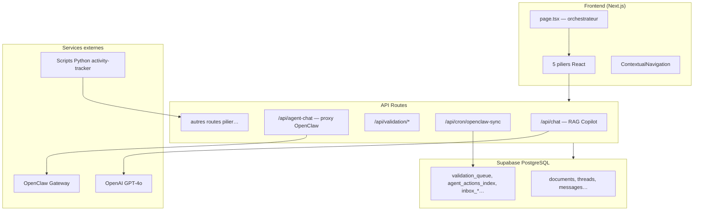

# OrbitAI — Documentation projet

> **Objectif de ce document** : fournir une vue d'ensemble complète et précise d'OrbitAI, utilisable comme base de connaissance (ChatGPT, onboarding, architecture). Pour le détail technique historique, voir aussi `DOCUMENTATION_TECHNIQUE.md` et `docs/ARCHITECTURE_OPENCLAW_VALIDATION.md`.

---

## 1. Qu'est-ce qu'OrbitAI ?

**OrbitAI** est une plateforme SaaS d'intelligence artificielle stratégique pour entreprises. Elle s'organise en **5 piliers fonctionnels** indépendants, chacun couvrant un aspect de l'optimisation opérationnelle et décisionnelle :

| Pilier | ID | Statut | Rôle |
|--------|-----|--------|------|
| Copilote IA & Transmission | `copilot-transmission` | ✅ Actif | RAG sur documents internes, chat onboarding, transmission de savoir |
| Détection & Automatisation | `detection-automation` | ✅ Actif | Détection de tâches grises, tracking d'activité, automatisations |
| Simulation décisionnelle | `decision-simulation` | ✅ Actif | Scénarios stratégiques, comparaison, export PDF |
| Synthèse intelligente client | `client-synthesis` | ✅ Actif | Agrégation retours clients, analyse marketing, monitoring |
| IA émotionnelle | `emotional-ai` | ⏳ Placeholder | Analyse des interactions (non implémenté) |

**Positionnement produit (2025)** : OrbitAI évolue vers une **Knowledge Platform** (transmission de savoir, centre de connaissances, onboarding). Le moteur de **validation humaine** devient l’**AI Review Engine** (composant transverse). **OpenClaw n’est plus le positionnement produit** — retrait progressif côté UI (Phase A) puis backend (phases B–D). Voir `project_state.md`.

---

## 2. Stack technique

| Couche | Technologie |
|--------|-------------|
| Frontend | Next.js 15 (App Router), React 19, Tailwind CSS 4 |
| Backend | API Routes Next.js (Edge ou Node selon la route) |
| Base de données métier | **Supabase PostgreSQL** + client JS + RLS |
| Auth principale | **Supabase Auth** (cookies HTTP-only via `@supabase/ssr`) |
| Auth secondaire | NextAuth.js + Prisma (Discord provider, tables NextAuth uniquement) |
| IA | OpenAI GPT-4o via `@ai-sdk/openai` et Vercel AI SDK (`streamText`, `generateText`) |
| Typage | TypeScript, Zod (schémas OpenClaw) |
| PDF / docs | `pdf-parse-fork`, `mammoth`, `xlsx`, `pptx2json` |
| Agent externe | OpenClaw Gateway (Chat Completions API) |

**Scripts npm** : `npm run dev` (Turbo), `npm run build`, `npm run check` (lint + tsc), `npm run db:push` (Prisma/NextAuth).

---

## 3. Architecture globale



### Point d'entrée UI

- **`src/app/page.tsx`** : composant client principal. Vérifie la session Supabase, redirige vers `/login` si absent, orchestre le pilier actif, l'onglet actif et les threads Copilot.
- **`src/features/pillars/types.ts`** : définition des piliers (`PILLARS`, `PillarId`, `enabled`).
- **`src/features/pillars/components/ContextualNavigation.tsx`** : navigation adaptative par pilier.

Chaque pilier vit dans `src/features/pillars/{pilier-id}/` avec ses composants, hooks et parfois un `setup.sql` local (legacy — le schéma canonique est `database/init.sql`).

---

## 4. Structure du dépôt

```
orbit-ai/
├── database/
│   ├── init.sql              # Schéma complet (piliers + OpenClaw) — source de vérité
│   ├── reset.sql             # Suppression de toutes les tables OrbitAI
│   └── migrations/           # Historique incrémental (001–005, intégré dans init.sql)
├── docs/
│   └── ARCHITECTURE_OPENCLAW_VALIDATION.md
├── scripts/
│   ├── activity-tracker.py           # macOS
│   └── activity-tracker-windows.py   # Windows
├── data/exchange/            # Dossiers legacy file-based (remplacés par inbox_* en base)
├── src/
│   ├── app/
│   │   ├── page.tsx            # Dashboard principal
│   │   ├── login/              # Authentification Supabase
│   │   ├── auth/callback/      # Callback OAuth Supabase
│   │   └── api/                # Toutes les routes API
│   ├── features/pillars/       # Modules métier par pilier
│   ├── components/             # ValidationDashboard, AutomationSettings
│   ├── lib/
│   │   ├── openclaw/           # schema.ts, sync-worker.ts, paths.ts
│   │   └── storage.ts          # Couche d'accès Supabase (OpenClaw + policies)
│   ├── server/                 # auth NextAuth, tRPC (minimal)
│   ├── utils/supabase/         # Client browser Supabase
│   └── types/database.types.ts # Types TS des tables Supabase
├── prisma/schema.prisma        # Uniquement tables NextAuth
└── DOCUMENTATION_TECHNIQUE.md  # Doc technique détaillée (historique)
```

---

## 5. Les piliers en détail

### 5.1 Copilote IA & Transmission (`copilot-transmission`)

**Emplacement** : `src/features/pillars/copilot-transmission/`

**Fonctionnalités** :
- Upload de documents (PDF, etc.) → extraction de texte → stockage dans `documents.full_text`
- Chat RAG : réponses basées **uniquement** sur la base de connaissances de l'utilisateur
- Threads de conversation avec titres générés par IA
- Mode **Agent OpenClaw** (optionnel) : raisonnement avancé via Gateway externe

**Hook** : `hooks/useCopilot.ts` — CRUD threads/messages, upload, streaming chat.

**API** :
| Route | Rôle |
|-------|------|
| `POST /api/chat` | Chat streaming + RAG (Edge) |
| `POST /api/agent-chat` | Proxy vers OpenClaw Gateway (Edge) |
| `POST /api/extract` | Extraction texte PDF/docs (Node) |
| `POST /api/detect-tasks` | Détection tâches grises depuis un document (Edge) |

**Algorithme RAG** (`/api/chat`) :
1. Récupère tous les `documents` de l'utilisateur (Supabase)
2. Extrait les mots-clés de la question (> 2 caractères)
3. Score les documents (occurrences, phrases complètes, proximité)
4. Sélectionne les top 5 passages (max ~1500 caractères chacun)
5. Injecte dans le prompt système GPT-4o avec consigne de citer les sources `[Source: Document X: fichier.pdf]`
6. Stream la réponse, sauvegarde dans `messages`, met à jour le titre du thread

**Tables** : `documents`, `threads`, `messages`

---

### 5.2 Simulation décisionnelle (`decision-simulation`)

**Emplacement** : `src/features/pillars/decision-simulation/`

**Fonctionnalités** :
- Conversation guidée pour poser une question stratégique
- Génération de 3–5 scénarios avec métriques par GPT-4o
- Comparaison visuelle, archivage, export PDF (jsPDF)

**Hook** : `hooks/useDecisionSimulation.ts`

**API** :
| Route | Rôle |
|-------|------|
| `POST /api/decision-chat` | Chat conversationnel pour affiner le contexte |
| `POST /api/decision-generate` | Génération structurée de scénarios |

**Table** : `decision_simulations` (champs JSON : `context`, `conversation`, `scenarios`, `selected_scenarios`)

---

### 5.3 Détection & Automatisation (`detection-automation`)

**Emplacement** : `src/features/pillars/detection-automation/`

**Fonctionnalités** :
- Détection automatique de **tâches grises** (tâches répétitives automatisables)
- Sources : documents uploadés, historique d'actions, script de tracking système
- Gestion des automatisations et historique d'exécution
- Analyse conversationnelle par IA (`AutomationAnalyzer`)
- Onglet **Validation** : file Human-in-the-Loop OpenClaw + Auto-Pilot

**Hook** : `hooks/useAutomation.ts`

**API** :
| Route | Rôle |
|-------|------|
| `POST /api/detect-tasks` | Analyse document → `gray_tasks` |
| `POST /api/analyze-history` | Analyse 30 jours de `user_actions` + messages |
| `POST /api/track-activity` | Réception snapshots activité (script Python) |
| `GET /api/tracking-status` | Statut du tracking |
| `GET /api/generate-tracker-script` | Génère script personnalisé (.command / .bat) |
| `POST /api/tasks/validate` | Validation de tâches grises |

**Scripts externes** (`scripts/`) :
- Collectent fenêtre active, apps, emails, onglets toutes les ~60s
- Envoient vers `/api/track-activity` → sauvegarde dans `user_actions` (`action_type: 'activity_snapshot'`)
- Génération personnalisée avec `USER_ID` pré-rempli via `/api/generate-tracker-script`

**Tables** : `gray_tasks`, `automations`, `automation_executions`, `user_actions`

---

### 5.4 Synthèse intelligente client (`client-synthesis`)

**Emplacement** : `src/features/pillars/client-synthesis/`

**Fonctionnalités** :
- Import de retours clients (CSV, JSON, manuel)
- Sources configurables (email, ticket, review, survey, social…)
- **Monitoring automatique** : surveillance d'URLs (Google Reviews, Trustpilot…) via `GOOGLE_PLACES_API_KEY`
- Analyse IA marketing : forces, faiblesses, leviers, opportunités, menaces, recommandations
- Comparaison temporelle entre analyses

**Hook** : `hooks/useClientSynthesis.ts`

**API** :
| Route | Rôle |
|-------|------|
| `POST /api/client-feedback/import` | Import de retours |
| `POST /api/client-feedback/analyze` | Analyse marketing complète |
| `POST /api/client-feedback/fetch-monitoring` | Récupération avis via Google Places |

**Tables** : `client_feedback_sources`, `client_feedback_items`, `marketing_analysis`

---

### 5.5 IA émotionnelle (`emotional-ai`)

**Statut** : placeholder UI uniquement (`EmotionalPillar.tsx`). Pilier désactivé dans `PILLARS` (`enabled: false`). Utilisé comme pilier par défaut dans `page.tsx` pour afficher le dashboard global système.

---

## 6. OpenClaw — Agent, validation et Auto-Pilot

OpenClaw est un **agent d'entreprise externe** qui exécute des actions et produit des logs structurés. OrbitAI gère la **mémoire RAG**, la **validation humaine** et l'**Auto-Pilot** (auto-approbation progressive).

### 6.1 Principes fondamentaux

```
Exécution (OpenClaw)  →  Inbox base de données  →  Worker cron  →  Mémoire RAG / File validation
                                                                 ↓
                                                          Humain approuve/rejette
                                                                 ↓
                                                          agent_actions_index (RAG)
```

- **Le RAG ne lit jamais une action non validée** : seule `agent_actions_index` alimente la mémoire agent (+ `documents` pour le Copilot).
- **Architecture database-first** : les tables `inbox_*` remplacent l'ancien système de fichiers (`data/exchange/inbox/*`). Le worker ne lit plus le disque local.
- **Skills** : `skill_manifests` remplace `data/skills/` — procédures d'exécution par `action_type`.

### 6.2 Schéma JSON des événements OpenClaw

Défini dans `src/lib/openclaw/schema.ts` (Zod) :

```json
{
  "event_id": "550e8400-e29b-41d4-a716-446655440000",
  "timestamp": "2025-02-28T14:30:00.000Z",
  "action": "send_email",
  "status": "pending_validation | executed | failed",
  "payload": { },
  "rationale": "Justification de l'agent",
  "human_input_required": true,
  "user_id": "uuid-optionnel"
}
```

### 6.3 Tables OpenClaw

| Table | Rôle |
|-------|------|
| `inbox_agent_logs` | File d'entrée événements bruts (processed_at NULL = à traiter) |
| `inbox_reports` | Rapports journaliers en attente |
| `inbox_validation` | Demandes de validation en attente |
| `validation_queue` | File Human-in-the-Loop (`pending` / `approved` / `rejected`, + `executed_at`) |
| `agent_actions_index` | Mémoire RAG (actions exécutées ou approuvées) |
| `daily_reports` | Rapports journaliers consolidés |
| `agent_logs` | Logs append-only côté app |
| `skill_manifests` | Manifests de skills par `action_type` |
| `automation_policies` | Auto-Pilot : statut par `(user_id, action_type)` |

**Vue** : `v_user_action_success_count` — compte les succès par action depuis `agent_actions_index`.

**Fonction SQL** : `get_success_count_by_action(user_id)` — utilisée pour déclencher les paliers Auto-Pilot.

### 6.4 Worker de synchronisation

**Fichier** : `src/lib/openclaw/sync-worker.ts`  
**Endpoint cron** : `GET|POST /api/cron/openclaw-sync` (runtime Node.js)  
**Auth** : header `Authorization: Bearer <CRON_SECRET>` ou `OPENCLAW_SYNC_SECRET`

**Étapes du worker** (`runOpenClawSync`) :

1. `inbox_reports` → insert `daily_reports` → marquer `processed_at`
2. `inbox_validation` → upsert `validation_queue` → marquer `processed_at`
3. `inbox_agent_logs` :
   - `status=executed` → insert `agent_actions_index`
   - `status=pending_validation` + policy `ENABLED` → auto-approbation → `agent_actions_index` (status `auto_approved`)
   - `status=pending_validation` sans Auto-Pilot → insert `validation_queue`
   - `status=failed` → ignoré
4. `validation_queue` (approved, `executed_at IS NULL`) → exécution via `skill_manifests` → marquer `executed_at`

### 6.5 API Validation (Human-in-the-Loop)

| Route | Méthode | Rôle |
|-------|---------|------|
| `/api/validation/queue` | GET | Liste tâches `pending` pour un `user_id` |
| `/api/validation/approve` | POST | Approuve (`event_id`) → insert `agent_actions_index` |
| `/api/validation/reject` | POST | Rejette avec raison optionnelle |
| `/api/validation/status` | GET | Polling statut par `event_id` (pour OpenClaw) |

**UI** : `src/components/ValidationDashboard.tsx` (onglet Validation du pilier Automatisation)

### 6.6 Auto-Pilot (deux paliers de confiance)

**Statuts** `automation_policies.status` :
- `PENDING` — palier 1 proposé (≥ 50 succès sur une action)
- `ENABLED` — auto-approbation active
- `DECLINED_50` — refus palier 1, palier 2 proposé (≥ 50 succès)
- `DECLINED_100` — révoqué manuellement, retour file validation

**API** :
| Route | Rôle |
|-------|------|
| `GET /api/automation-policies?user_id=` | Liste policies + success_count, crée `PENDING` si ≥ 50 succès |
| `PATCH /api/automation-policies` | Met à jour le statut (acceptation/refus/révocation) |
| `GET /api/automation-policies/enabled?user_id=` | Liste des actions en Auto-Pilot actif |

**UI** : modales Auto-Pilot dans `ValidationDashboard`, révocation dans `AutomationSettings` (Réglages).

### 6.7 Mode Agent dans le Copilote

Quand `NEXT_PUBLIC_OPENCLAW_ENABLED=true` :
- Le Copilote affiche un sélecteur Copilot / Agent
- Le mode Agent appelle `POST /api/agent-chat` → proxy vers OpenClaw Gateway `/v1/chat/completions`
- Session stable par utilisateur : header `x-openclaw-session-key: orbit:<userId>`
- Conversion SSE OpenClaw → flux texte pour le client React existant

**Config Gateway OpenClaw** (côté OpenClaw) :
```json5
gateway: { http: { endpoints: { chatCompletions: { enabled: true } } } }
```

---

## 7. Base de données

### 7.1 Deux systèmes coexistent

| Système | Usage |
|---------|-------|
| **Supabase PostgreSQL** | Toutes les données métier (piliers + OpenClaw) |
| **Prisma + PostgreSQL** | Uniquement tables NextAuth (`User`, `Account`, `Session`, `VerificationToken`) |

### 7.2 Initialisation

**Nouvelle base ou reset complet** :
```sql
-- 1. Supprimer (optionnel)
\i database/reset.sql

-- 2. Créer tout le schéma
\i database/init.sql
```

`database/init.sql` est la **source de vérité** — il inclut les piliers 1–5, le système de préférences/feedback, la synthèse client, et tout OpenClaw (ex-migrations 001–005).

Les fichiers `database/migrations/*.sql` restent comme historique incrémental pour les bases déjà montées étape par étape.

### 7.3 Tables par domaine

**Copilot** : `documents`, `threads`, `messages`

**Décision** : `decision_simulations`

**Automatisation** : `gray_tasks`, `automations`, `automation_executions`, `user_actions`

**Apprentissage** : `user_preferences`, `message_feedback` (+ trigger `update_user_preferences_from_feedback`)

**Synthèse client** : `client_feedback_sources`, `client_feedback_items`, `marketing_analysis`

**OpenClaw** : voir section 6.3

### 7.4 Sécurité des données

- **Row Level Security (RLS)** activé sur toutes les tables utilisateur
- Filtrage systématique par `auth.uid() = user_id`
- INSERT sur tables worker (`inbox_*`, `agent_actions_index`) : réservé à la clé **service_role** Supabase
- Isolation stricte : aucun accès cross-user

---

## 8. Catalogue complet des API Routes

| Route | Runtime | Description |
|-------|---------|-------------|
| `POST /api/chat` | Edge | Chat RAG Copilot (streaming) |
| `POST /api/agent-chat` | Edge | Proxy OpenClaw Gateway |
| `POST /api/extract` | Node | Extraction texte documents |
| `POST /api/detect-tasks` | Edge | Détection tâches grises |
| `POST /api/decision-chat` | Edge | Chat simulation décisionnelle |
| `POST /api/decision-generate` | Edge | Génération scénarios |
| `POST /api/analyze-history` | Edge | Analyse historique activité |
| `POST /api/analyze-preferences` | Edge | Analyse préférences utilisateur |
| `POST /api/track-activity` | Edge | Réception snapshots tracking |
| `GET /api/tracking-status` | Edge | Statut tracking |
| `GET /api/generate-tracker-script` | Node | Génération script tracker |
| `POST /api/feedback` | Edge | Feedback sur messages Copilot |
| `POST /api/client-feedback/import` | Node | Import retours clients |
| `POST /api/client-feedback/analyze` | Node | Analyse marketing IA |
| `POST /api/client-feedback/fetch-monitoring` | Node | Fetch avis Google Places |
| `GET /api/validation/queue` | Node | File validation OpenClaw |
| `POST /api/validation/approve` | Node | Approuver action |
| `POST /api/validation/reject` | Node | Rejeter action |
| `GET /api/validation/status` | Node | Statut validation (polling) |
| `GET /api/automation-policies` | Node | Policies Auto-Pilot |
| `PATCH /api/automation-policies` | Node | Mise à jour policy |
| `GET /api/automation-policies/enabled` | Node | Policies ENABLED |
| `GET\|POST /api/cron/openclaw-sync` | Node | Worker sync OpenClaw |
| `POST /api/tasks/validate` | Node | Validation tâches grises |
| `/api/auth/[...nextauth]` | — | NextAuth (fallback) |
| `/api/trpc/[trpc]` | — | tRPC (minimal, héritage T3) |

**Couche storage** : `src/lib/storage.ts` centralise les opérations Supabase pour OpenClaw (validation, inbox, policies, skills, agent_logs).

---

## 9. Authentification

### Flux principal (Supabase)

1. Utilisateur non authentifié → redirection `/login`
2. Login Supabase (email/OAuth selon config projet)
3. Callback → `src/app/auth/callback/route.ts`
4. Session stockée en cookies HTTP-only
5. Chaque requête client vérifie `supabase.auth.getSession()`

### NextAuth (secondaire)

- Config : `src/server/auth/config.ts`
- Provider Discord configuré
- Utilisé pour Prisma/NextAuth, pas pour le flux principal métier

---

## 10. Variables d'environnement

Copier `.env.example` → `.env`. Schéma validé dans `src/env.js`.

### Obligatoires (build)

| Variable | Description |
|----------|-------------|
| `AUTH_SECRET` | Secret NextAuth (prod) |
| `AUTH_DISCORD_ID` / `AUTH_DISCORD_SECRET` | Provider Discord NextAuth |
| `DATABASE_URL` | PostgreSQL pour Prisma/NextAuth |

### Supabase (runtime — pas dans env.js mais requis)

| Variable | Description |
|----------|-------------|
| `NEXT_PUBLIC_SUPABASE_URL` | URL projet Supabase |
| `NEXT_PUBLIC_SUPABASE_ANON_KEY` | Clé publique Supabase |
| `SUPABASE_SERVICE_ROLE_KEY` | Clé service (worker, APIs serveur) |

### IA

| Variable | Description |
|----------|-------------|
| `OPENAI_API_KEY` | Clé OpenAI GPT-4o |

### OpenClaw Gateway (optionnel)

| Variable | Description |
|----------|-------------|
| `OPENCLAW_GATEWAY_URL` | ex. `http://127.0.0.1:18789` |
| `OPENCLAW_GATEWAY_TOKEN` | Token auth Gateway |
| `OPENCLAW_AGENT_ID` | ID agent (défaut `main`) |
| `NEXT_PUBLIC_OPENCLAW_ENABLED` | `true` pour afficher mode Agent |

### Worker sync (optionnel)

| Variable | Description |
|----------|-------------|
| `CRON_SECRET` ou `OPENCLAW_SYNC_SECRET` | Protection endpoint cron |
| `OPENCLAW_DEFAULT_USER_ID` | User ID par défaut si absent des logs |

### Synthèse client (optionnel)

| Variable | Description |
|----------|-------------|
| `GOOGLE_PLACES_API_KEY` | Monitoring avis Google |

---

## 11. Installation et démarrage

### Prérequis

- Node.js 20+
- Projet Supabase (Auth + PostgreSQL)
- Clé OpenAI
- (Optionnel) Gateway OpenClaw, Google Places API

### Setup

```bash
git clone <repo>
cd orbit-ai
cp .env.example .env
# Remplir les variables

npm install
npm run db:push          # Tables NextAuth via Prisma

# Dans Supabase SQL Editor :
# Exécuter database/init.sql (ou reset.sql puis init.sql)
```

```bash
npm run dev              # http://localhost:3000
```

### Cron OpenClaw (production)

Configurer un cron (Vercel Cron, GitHub Actions, etc.) :

```
GET https://<domaine>/api/cron/openclaw-sync
Authorization: Bearer <CRON_SECRET>
```

Fréquence recommandée : toutes les 1–5 minutes selon le volume.

---

## 12. Flux de données essentiels

### Conversation Copilot avec RAG

```
Upload PDF → /api/extract → documents (Supabase)
         → /api/detect-tasks → gray_tasks (bonus)

Question → /api/chat :
  1. Fetch documents user
  2. findRelevantPassages() — scoring mots-clés
  3. Prompt GPT-4o + contexte RAG
  4. Stream réponse + citations
  5. Save messages + update thread.title
```

### Action OpenClaw avec validation

```
OpenClaw exécute action → insert inbox_agent_logs (status=pending_validation)
                       ↓
Cron /api/cron/openclaw-sync :
  - policy ENABLED ? → agent_actions_index (auto_approved)
  - sinon → validation_queue (pending)
                       ↓
Humain → /api/validation/approve → agent_actions_index
      ou /api/validation/reject  → pas d'index RAG
                       ↓
Worker → executeApprovedAction (skill_manifests) → executed_at
```

### Auto-Pilot

```
50+ succès sur action → GET /api/automation-policies crée PENDING
                      ↓
UI modal palier 1 → ENABLED ou DECLINED_50
Palier 2 (si DECLINED_50 + 50 succès) → ENABLED ou reste DECLINED_50
Révocation manuelle → DECLINED_100 → retour file validation
```

---

## 13. Interface utilisateur

- **Design** : dark theme (slate-900/950), accents colorés par pilier
- **Icônes** : Lucide React
- **Navigation** : sidebar `ContextualNavigation` + onglets contextuels par pilier
- **Dashboard global** : accessible via menu Système quand le pilier actif n'a pas son propre dashboard
- **Réglages** : placeholder + `AutomationSettings` (révocation Auto-Pilot)

Couleurs piliers (`src/features/pillars/utils/pillarColors.ts`) :
- Copilot : cyan | Automatisation : violet | Décision : sky | Émotionnel : rose | Client : emerald

---

## 14. État du projet et évolutions

### Implémenté

- 4 piliers fonctionnels (Copilot, Automatisation, Décision, Synthèse client)
- RAG documentaire complet
- Tracking d'activité macOS/Windows
- OpenClaw : validation HITL, worker database-first, Auto-Pilot
- Export PDF simulations

### En cours / à venir

- Pilier IA émotionnelle (placeholder)
- Workflow builder automatisations
- Réglages utilisateur (page placeholder)
- Intégrations externes (email, fichiers)
- Templates d'automatisation

### Fichiers de référence

| Fichier | Contenu |
|---------|---------|
| `DOCUMENTATION_TECHNIQUE.md` | Doc technique détaillée (peut contenir des infos légèrement obsolètes sur OpenClaw file-based) |
| `docs/ARCHITECTURE_OPENCLAW_VALIDATION.md` | Architecture validation OpenClaw (schéma JSON, flux) |
| `database/init.sql` | Schéma SQL canonique complet |
| `database/RESET_INSTRUCTIONS.md` | Procédure reset base |
| `SETUP_GOOGLE_PLACES_API.md` | Config Google Places pour monitoring avis |

---

## 15. Conventions de développement

- **Nouveau pilier** : créer `src/features/pillars/{id}/`, ajouter dans `types.ts` et `index.ts`, brancher dans `page.tsx`
- **Nouvelle table** : ajouter dans `database/init.sql` + `database/reset.sql` + `src/types/database.types.ts`
- **Nouvelle route API** : `src/app/api/{nom}/route.ts`, choisir `runtime = 'edge'` ou `'nodejs'` selon besoins Node.js
- **OpenClaw** : toujours passer par `src/lib/storage.ts` pour les accès Supabase
- **Schémas JSON** : Zod dans `src/lib/openclaw/schema.ts`
- **Commits** : messages concis, focus sur le pourquoi
- **Langue UI** : français

---

*Dernière mise à jour : juin 2025 — reflète l'état du dépôt incluant init.sql complet (OpenClaw database-first + Auto-Pilot).*
