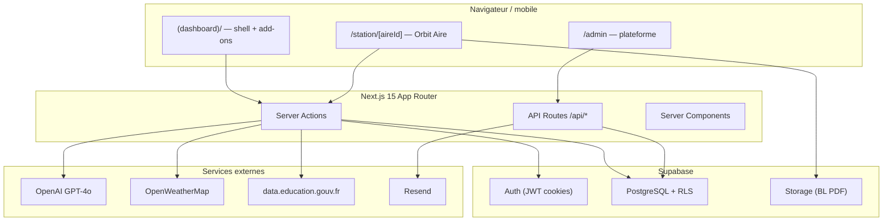
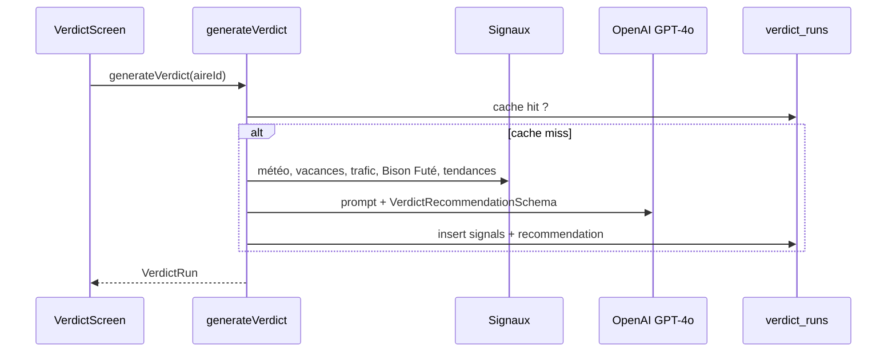

# OrbitAll — Documentation projet

> **Plateforme SaaS multi-tenant** développée par **AlphaSys**, hébergeant des applications métier verticales activables par organisation, sur une base commune (auth, organisations, modules) + des add-ons IA transverses.
>
> Documentation produit détaillée : dossier **[`Claude/`](./Claude/README.md)** (`architecture.md`, `regiaire-reference.md`, `cowork-integration.md`). Le présent fichier est la vue d'ensemble technique du dépôt.

---

## 1. Qu'est-ce qu'OrbitAll ?

OrbitAll n'est plus positionné comme « 5 piliers IA ». C'est aujourd'hui une **plateforme multi-tenant** qui héberge des **verticals métier** activables par client (organisation), plus des **add-ons IA** optionnels.

### Verticals métier

| Priorité | Module (BDD) | Marque UI | Statut |
|----------|--------------|-----------|--------|
| **Cœur actuel** | `regiaire_core` | **Orbit Aire** *(anciennement RégiAire — identifiants techniques `regiaire_*` conservés)* | ✅ Implémenté et maintenu |
| Roadmap | `artisan_core` | **Orbit Artisan** | Catalogue / branding prêts, pas de code métier |
| Roadmap | `hotel_core` | **Orbit Hôtel** | Catalogue / branding prêts, pas de code métier |

### Add-ons IA (ex-« piliers »)

Activables par organisation, ils ne pilotent plus la roadmap :

| Add-on | Module | Statut | Rôle |
|--------|--------|--------|------|
| Copilote IA & Transmission | `copilot-transmission` | ✅ Actif | RAG sur documents, chat, transmission de savoir |
| Détection & Automatisation | `detection-automation` | ✅ Actif | Tâches grises, tracking d'activité, révisions IA |
| Simulation décisionnelle | `decision-simulation` | ✅ Actif | Scénarios stratégiques, comparaison, export PDF |
| Synthèse intelligente client | `client-synthesis` | ✅ Actif | Agrégation retours clients, analyse marketing, monitoring |
| IA émotionnelle | `emotional-ai` | ⏳ Placeholder | Non implémenté |

> **OpenClaw retiré.** L'ancien agent externe OpenClaw (Gateway, worker de sync, mode Agent du Copilote) a été **supprimé du code**. Ce qui subsiste est l'**AI Review Engine** (`/api/review/*`) pour la validation humaine côté Copilot, et quelques variables d'env legacy (`OPENCLAW_*`) conservées pour compat build.

---

## 2. Stack technique

| Couche | Technologie |
|--------|-------------|
| Frontend | Next.js 15 (App Router), React 19, Tailwind CSS 4 |
| Backend | **Server Actions** (métier Orbit Aire) + API Routes Next.js |
| Base de données | **Supabase PostgreSQL** + RLS |
| Storage | Supabase Storage (bucket `regiaire-bl` — PDF bons de livraison) |
| Auth principale | **Supabase Auth** (cookies HTTP-only via `@supabase/ssr`) |
| Auth legacy | NextAuth.js + Prisma (provider Discord, tables NextAuth uniquement) |
| IA | OpenAI GPT-4o via `@ai-sdk/openai` et Vercel AI SDK (`streamText`, `generateObject`) |
| Emails | Resend (transactionnel + réception BL par email) |
| Typage / validation | TypeScript, Zod |
| PDF / docs | `pdf-parse`, `pdf-parse-fork`, `mammoth`, `xlsx`, `pptx2json`, `jspdf` |
| Scan | `@zxing/browser` (scan EAN mobile Orbit Aire) |

**Scripts npm** : `npm run dev` (Turbo), `npm run build`, `npm run check` (lint + tsc), `npm run typecheck`, `npm run db:push` (Prisma/NextAuth).

---

## 3. Architecture globale


```mermaid
flowchart TB
  subgraph Clients["Navigateur / mobile"]
    Dash["(dashboard)/ — shell + add-ons"]
    Station["/station/[aireId] — Orbit Aire"]
    Admin["/admin — plateforme"]
  end

  subgraph Next["Next.js 15 App Router"]
    SA["Server Actions"]
    API["API Routes /api/*"]
    RSC["Server Components"]
  end

  subgraph Supa["Supabase"]
    Auth["Auth (JWT cookies)"]
    PG["PostgreSQL + RLS"]
    Store["Storage (BL PDF)"]
  end

  subgraph Ext["Services externes"]
    OpenAI["OpenAI GPT-4o"]
    OWM["OpenWeatherMap"]
    Edu["data.education.gouv.fr"]
    Resend["Resend"]
  end

  Dash --> SA
  Station --> SA
  Admin --> API
  SA --> PG
  API --> PG
  SA --> Auth
  Station --> Store
  SA --> OpenAI
  SA --> OWM
  SA --> Edu
  API --> Resend
```

### Points d'entrée

- **`src/app/(dashboard)/page.tsx`** : dashboard principal (route group `(dashboard)`, URL `/`). Vérifie la session Supabase, affiche les modules activés de l'organisation (Orbit Aire + add-ons piliers).
- **`src/app/(dashboard)/station/[aireId]/`** : espace opérationnel Orbit Aire par aire.
- **`src/app/(dashboard)/admin/`** : administration plateforme (clients, aires, Bison Futé).

---

## 4. Structure du dépôt

```
orbit-ai/
├── Claude/                     # Documentation produit à jour (2026)
├── database/
│   ├── init.sql                # Schéma complet idempotent — source de vérité
│   ├── reset.sql               # Suppression des tables OrbitAll
│   ├── migrations/             # Historique incrémental 001–034
│   ├── seeds/                  # Données démo Orbit Aire (013–017)
│   └── RESET_INSTRUCTIONS.md
├── scripts/
│   ├── activity-tracker.py           # macOS (add-on Automatisation)
│   └── activity-tracker-windows.py   # Windows
├── src/
│   ├── app/
│   │   ├── (dashboard)/        # Dashboard, station Orbit Aire, admin
│   │   ├── login/              # Authentification Supabase
│   │   ├── auth/               # callback OAuth + set-password
│   │   └── api/                # Routes API (voir §8)
│   ├── features/
│   │   ├── regiaire/           # CŒUR MÉTIER (réception, verdict, équipe…)
│   │   ├── organization/       # Multi-tenant : profil org, membres, fournisseurs
│   │   ├── admin/              # Provisioning clients, Bison Futé admin
│   │   └── pillars/            # Add-ons IA (5 piliers)
│   ├── lib/
│   │   ├── regiaire/           # Contexte, scope aire, équipe, accès
│   │   ├── organizations/      # Catalogue modules, navigation, branding SaaS
│   │   ├── admin/              # Provisioning comptes/clients
│   │   ├── auth/               # Mots de passe par défaut / changement forcé
│   │   ├── review/             # AI Review Engine (queue, publish)
│   │   ├── reviews/            # Sync avis Google
│   │   ├── storage.ts          # Couche Supabase (review queue, policies…)
│   │   └── supabase-write.ts   # Écritures typées
│   ├── server/auth/            # Supabase server + NextAuth legacy
│   ├── utils/supabase/         # Client browser Supabase
│   └── types/database.types.ts # Types TS des tables Supabase
├── prisma/schema.prisma        # Uniquement tables NextAuth
└── DOCUMENTATION_TECHNIQUE.md  # Doc technique historique
```

---

## 5. Multi-tenant et modules

### Modèle conceptuel

```
organizations
  ├── organization_members (user_id, role: owner | admin | member)
  ├── organization_modules (module_name, is_enabled)
  └── aires (Orbit Aire — une org peut en avoir plusieurs)
```

- **Catalogue des modules** : `src/lib/organizations/module-catalog.ts`
- **Types / noms de modules** : `src/lib/organizations/types.ts` (`ORG_MODULE_NAMES`)
- **Vérification runtime** : RPC Supabase `org_has_module`, `get_my_enabled_modules`
- **Branding dashboard** : `src/lib/organizations/saas-branding.ts` (Orbit Aire / Orbit Artisan / Orbit Hôtel)
- **Navigation** : `src/lib/organizations/navigation.ts` → `buildStationNavLinks(aireId)`

### Rôles

| Rôle | Périmètre |
|------|-----------|
| `owner` / `admin` (org) | Réglages org, membres, délais fournisseurs |
| `member` (org) | Opérations Orbit Aire sur les aires de l'org |
| Admin plateforme | `ORBIT_ADMIN_EMAILS` → `/admin`, opérations `service_role` (Bison Futé, provisioning) |

---

## 6. Orbit Aire — cœur métier

Gestion opérationnelle de **stations-service / aires autoroutières**, multi-sites. Le métier passe majoritairement par des **Server Actions** (pas d'API REST publique).

| Domaine | Fonctionnalités livrées | Emplacement |
|---------|-------------------------|-------------|
| **Aires** | CRUD, lat/lon, zone scolaire, jours de commande, zone Bison Futé, adresse (autocomplete BAN) | `features/regiaire/aires/` |
| **Réception** | BL (upload + extraction IA + email inbound), scan EAN mobile, stock par lots (`stock_batches`), DLC, finalisation via RPC | `features/regiaire/reception/`, `inbound/` |
| **Équipe** | Passation de quart, checklist tâches, historique, membres par aire | `features/regiaire/shift/`, `team/` |
| **Verdict IA** | Synthèse des signaux (météo, vacances, trafic, Bison Futé, tendances N-1) → recommandation merchandising GPT-4o (cache `verdict_runs`) | `features/regiaire/verdict/` |
| **Réappro v2 (étape A)** | Moteur déterministe en unités : projection demande, multiplicateurs heuristiques, `generateReplenishmentPlan` (pas d'UI dédiée) | `features/regiaire/verdict/replenishment/` |
| **Périmés** | Alertes lots J+0 à J+3 depuis le stock réel | `features/regiaire/verdict/` |
| **Vues** | Gérant multi-aires, chef de région, direction France, secteur | `features/regiaire/gerant/`, `region/`, `direction/`, `sector-manager/` |

### Pattern serveur

Toute action métier est scoped **org + aire** :

```typescript
const ctx = await requireRegiaireContext(aireId);
// ctx : { userId, organizationId, aireId, supabase, db }
await ctx.db.from("deliveries").insert({ /* ... */ });
```

Chaîne d'accès : session Supabase valide → org primaire de l'utilisateur → module `regiaire_core` activé → l'`aireId` appartient à l'org.

### Pipeline Verdict IA


```mermaid
sequenceDiagram
  participant UI as VerdictScreen
  participant GA as generateVerdict
  participant Sig as Signaux
  participant AI as OpenAI GPT-4o
  participant DB as verdict_runs
  UI->>GA: generateVerdict(aireId)
  GA->>DB: cache hit ?
  alt cache miss
    GA->>Sig: météo, vacances, trafic, Bison Futé, tendances
    GA->>AI: prompt + VerdictRecommendationSchema
    GA->>DB: insert signals + recommendation
  end
  GA-->>UI: VerdictRun
```

| Signal | Source | Fallback |
|--------|--------|----------|
| Météo | OpenWeatherMap | `available: false` |
| Vacances | API Éducation nationale | idem |
| Trafic | `traffic_signals` (BDD) | seed simulé |
| Bison Futé | `bison_fute_forecast` + zone aire | admin plateforme |
| Tendances | `sales_history` (15 j vs N-1 aligné) | seed simulé |

### Environnement de démo

| Champ | Valeur |
|-------|--------|
| Aire ID | `7ec3c50b-4893-4904-90d2-56e0ab04532a` (Aire Arzens SUD) |
| Org ID | `bba39426-6f78-4750-a77a-f5c0c991a878` |
| Seed | `database/seeds/017_regiaire_arzens_demo.sql` |
| Constantes | `src/features/regiaire/lib/demo-aire.ts` |

---

## 7. Add-ons IA (piliers)

Les 5 piliers restent fonctionnels quand leur module est activé pour l'organisation. Ils vivent dans `src/features/pillars/{id}/`.

### 7.1 Copilote IA & Transmission (`copilot-transmission`)

- Upload de documents (PDF, docx, xlsx, pptx) → extraction texte → `documents.full_text`
- Chat RAG : réponses basées **uniquement** sur la base de connaissances de l'utilisateur (scoring mots-clés, top passages, citations `[Source: …]`)
- Threads avec titres générés par IA, feedback sur messages
- Onglet **Révisions IA** (AI Review Engine)
- API : `POST /api/chat` (streaming RAG), `POST /api/extract`, `POST /api/detect-tasks`, `POST /api/feedback`
- Tables : `documents`, `threads`, `messages`

### 7.2 Détection & Automatisation (`detection-automation`)

- Détection de **tâches grises** (répétitives, automatisables)
- Sources : documents, historique d'actions, script de tracking système (macOS/Windows)
- API : `POST /api/detect-tasks`, `POST /api/analyze-history`, `POST /api/analyze-preferences`, `POST /api/track-activity`, `GET /api/tracking-status`, `GET /api/generate-tracker-script`, `POST /api/tasks/validate`, `/api/automation-policies*`
- Tables : `gray_tasks`, `automations`, `automation_executions`, `user_actions`

### 7.3 Simulation décisionnelle (`decision-simulation`)

- Conversation guidée → génération de 3–5 scénarios GPT-4o avec métriques → comparaison + export PDF (jsPDF)
- API : `POST /api/decision-chat`, `POST /api/decision-generate`
- Table : `decision_simulations`

### 7.4 Synthèse intelligente client (`client-synthesis`)

- Import de retours clients (CSV, JSON, manuel), sources configurables
- Monitoring avis (Google Places via `GOOGLE_PLACES_API_KEY`), sync via cron
- Analyse IA marketing (forces, faiblesses, opportunités, menaces, recommandations)
- API : `POST /api/client-feedback/import`, `/analyze`, `/fetch-monitoring`, `GET|POST /api/cron/sync-reviews`
- Tables : `client_feedback_sources`, `client_feedback_items`, `marketing_analysis`

### 7.5 IA émotionnelle (`emotional-ai`)

Placeholder UI uniquement, désactivé.

---

## 8. Catalogue des API Routes

Le métier Orbit Aire passe par des **Server Actions**. Les routes REST ci-dessous couvrent les add-ons, l'admin et les intégrations externes (33 routes actives).

| Route | Domaine |
|-------|---------|
| `POST /api/chat` | Copilot RAG (streaming) |
| `POST /api/extract` | Extraction texte documents |
| `POST /api/detect-tasks` | Détection tâches grises |
| `POST /api/feedback` | Feedback messages Copilot |
| `POST /api/decision-chat` · `POST /api/decision-generate` | Simulation décisionnelle |
| `POST /api/analyze-history` · `POST /api/analyze-preferences` | Automatisation (analyse) |
| `POST /api/track-activity` · `GET /api/tracking-status` · `GET /api/generate-tracker-script` | Tracker d'activité |
| `POST /api/tasks/validate` | Validation tâches grises |
| `GET|PATCH /api/automation-policies` · `GET /api/automation-policies/enabled` | Auto-Pilot |
| `POST /api/client-feedback/import` · `/analyze` · `/fetch-monitoring` | Synthèse client |
| `GET|POST /api/cron/sync-reviews` | Cron sync avis |
| `GET /api/review/queue` · `POST /api/review/approve` · `/reject` · `GET /api/review/status` | AI Review Engine |
| `GET|PUT /api/user/review-settings` | Réglages révision utilisateur |
| `GET /api/admin/me` · `/accounts` · `/clients` · `/clients/[organizationId]` · `/address-search` | Admin plateforme |
| `GET /api/organizations/modules` | Modules activés de l'org |
| `GET /api/regiaire/address-search` | Autocomplete adresses (BAN) |
| `POST /api/regiaire/inbound-bl` | Webhook Resend — réception BL par email |
| `/api/auth/[...nextauth]` | NextAuth (legacy) |
| `/api/trpc/[trpc]` | tRPC (minimal, héritage T3) |

> Les anciennes routes `/api/validation/*`, `/api/agent-chat` et `/api/cron/openclaw-sync` ont été **supprimées**. Utiliser `/api/review/*` et `/api/cron/sync-reviews`.

---

## 9. Base de données

### Source de vérité

| Fichier | Rôle |
|---------|------|
| `database/init.sql` | Schéma complet idempotent |
| `database/migrations/001–034` | Historique incrémental (multi-tenant, Orbit Aire, RLS, etc.) |
| `database/seeds/013–017` | Données démo Orbit Aire |
| `src/types/database.types.ts` | Types TypeScript des tables |

### Initialisation

```sql
-- Optionnel : réinitialiser
\i database/reset.sql
-- Créer tout le schéma
\i database/init.sql
```

### Tables par domaine

- **Multi-tenant** : `organizations`, `organization_members`, `organization_modules`
- **Orbit Aire** : `aires`, `suppliers`, `products`, `deliveries`, `delivery_lines`, `stock_batches`, `sales_history`, `traffic_signals`, `verdict_runs`, `bison_fute_forecast`, `shift_closures`, `shift_task_defs`, `shift_task_checks`, `aire_team_members`
- **Copilot** : `documents`, `threads`, `messages`
- **Décision** : `decision_simulations`
- **Automatisation** : `gray_tasks`, `automations`, `automation_executions`, `user_actions`, `automation_policies`
- **Apprentissage** : `user_preferences`, `message_feedback`
- **Synthèse client** : `client_feedback_sources`, `client_feedback_items`, `marketing_analysis`
- **AI Review Engine** : `ai_review_queue`, `agent_actions_index`, `agent_logs`, `daily_reports`, `skill_manifests`

### Sécurité (RLS)

- Row Level Security activé sur toutes les tables utilisateur
- Orbit Aire : accès via `is_org_member(organization_id)`
- Add-ons : filtrage par `auth.uid() = user_id`
- Opérations admin plateforme (Bison Futé, provisioning) : clé **service_role**, jamais depuis le client user

---

## 10. Authentification

### Flux principal (Supabase)

1. Utilisateur non authentifié → redirection `/login`
2. Login Supabase (email / mot de passe) → cookies HTTP-only
3. Callback : `src/app/auth/callback/route.ts`
4. Changement de mot de passe forcé : `/auth/set-password`
5. Helpers serveur : `src/server/auth/supabase-server.ts` (`getAuthenticatedUser()`), `src/lib/supabase-write.ts` (`forWrite`)

### NextAuth (legacy)

- Config `src/server/auth/config.ts`, provider Discord, tables Prisma séparées. Non utilisé pour le flux métier.

---

## 11. Variables d'environnement

Copier `.env.example` → `.env`. Schéma validé dans `src/env.js`.

### Plateforme (obligatoires build)

| Variable | Description |
|----------|-------------|
| `AUTH_SECRET` | Secret NextAuth (requis en prod) |
| `AUTH_DISCORD_ID` / `AUTH_DISCORD_SECRET` | Provider Discord NextAuth (legacy) |
| `DATABASE_URL` | PostgreSQL pour Prisma/NextAuth |

### Supabase (runtime)

| Variable | Description |
|----------|-------------|
| `NEXT_PUBLIC_SUPABASE_URL` | URL projet Supabase |
| `NEXT_PUBLIC_SUPABASE_ANON_KEY` | Clé publique Supabase |
| `SUPABASE_SERVICE_ROLE_KEY` | Clé service (APIs serveur, admin) |

### IA & services

| Variable | Description |
|----------|-------------|
| `OPENAI_API_KEY` | OpenAI GPT-4o |
| `OWM_API_KEY` | OpenWeatherMap (météo Orbit Aire) |
| `GOOGLE_PLACES_API_KEY` | Monitoring avis (Synthèse client) |
| `RESEND_API_KEY` | Emails transactionnels + ACK réception BL |

### Orbit Aire / plateforme (optionnels)

| Variable | Description |
|----------|-------------|
| `ORBIT_ADMIN_EMAILS` | Emails admin plateforme (`/admin`), séparés par des virgules |
| `NEXT_PUBLIC_SITE_URL` | URL publique (invitations email) |
| `DEFAULT_ACCOUNT_PASSWORD` | Mot de passe initial des comptes créés |
| `REGIAIRE_SKIP_INVITE_EMAIL` | Dev : crée les comptes avec mot de passe provisoire au lieu d'un email |
| `RESEND_INBOUND_SECRET` | Secret webhook Resend Inbound (réception BL) |
| `INBOUND_EMAIL_DOMAIN` | Domaine email des aires (ex. `regiaire.alphasys.tech`) |

### Cron / add-ons (optionnels)

| Variable | Description |
|----------|-------------|
| `CRON_SECRET` | Protection routes cron (`/api/cron/sync-reviews`) |
| `REVIEW_POLLING_TOKEN` | Polling `GET /api/review/status` |
| `TRACKER_SIGNING_SECRET` | HMAC tracker Python (≥ 32 car. en prod) |

> Variables `OPENCLAW_*` et `NEXT_PUBLIC_OPENCLAW_ENABLED` : **legacy**, conservées uniquement pour compat build. OpenClaw est retiré du produit.

---

## 12. Installation et démarrage

### Prérequis

- Node.js 20+
- Projet Supabase (Auth + PostgreSQL + Storage)
- Clé OpenAI
- (Optionnel) OpenWeatherMap, Google Places, Resend

### Setup

```bash
git clone <repo>
cd orbit-ai
cp .env.example .env      # renseigner les variables
npm install
npm run db:push          # Tables NextAuth via Prisma

# Dans Supabase SQL Editor :
# Exécuter database/init.sql (ou reset.sql puis init.sql)
# Puis, pour la démo : database/seeds/017_regiaire_arzens_demo.sql
```

```bash
npm run dev              # http://localhost:3000
```

### Déploiement

- Cible : **Vercel** (Next.js)
- BDD : **Supabase** cloud (migrations via SQL Editor ou CI)
- Secrets : Vercel env vars — ne jamais committer `.env`

---

## 13. Conventions de développement

- **Nouvelle action Orbit Aire** : Server Action `"use server"` scoped via `requireRegiaireContext(aireId)`, schéma Zod, `*-access.ts` pour lectures réutilisables
- **Nouveau module vertical / add-on** : déclarer dans `src/lib/organizations/module-catalog.ts` + `types.ts`
- **Nouvelle table** : ajouter une migration `database/migrations/`, mettre à jour `init.sql`, `reset.sql` et `src/types/database.types.ts`
- **Nouvelle route API** : `src/app/api/{nom}/route.ts`, choisir `runtime = 'edge'` ou `'nodejs'`
- **Écritures Supabase typées** : passer par `forWrite()` (`src/lib/supabase-write.ts`)
- **Schémas IA** : Zod (`generateObject` / `streamText` via Vercel AI SDK)
- **Langue UI** : français

---

## 14. Fichiers de référence

| Fichier | Contenu |
|---------|---------|
| **`Claude/README.md`** | Vue produit à jour (2026) |
| `Claude/architecture.md` | Architecture technique complète |
| `Claude/regiaire-reference.md` | Orbit Aire : routes, actions, BDD, seeds |
| `Claude/cowork-integration.md` | Notes pour assistants IA |
| `DOCUMENTATION_TECHNIQUE.md` | Doc technique historique (peut contenir des infos legacy) |
| `database/init.sql` | Schéma SQL canonique |
| `database/RESET_INSTRUCTIONS.md` | Procédure de reset |

---

*Dernière mise à jour : juillet 2026 — Orbit Aire comme cœur métier, plateforme multi-tenant, add-ons piliers, OpenClaw retiré.*
